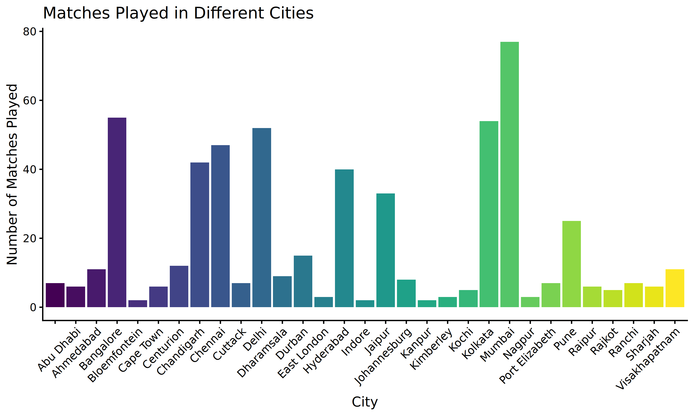
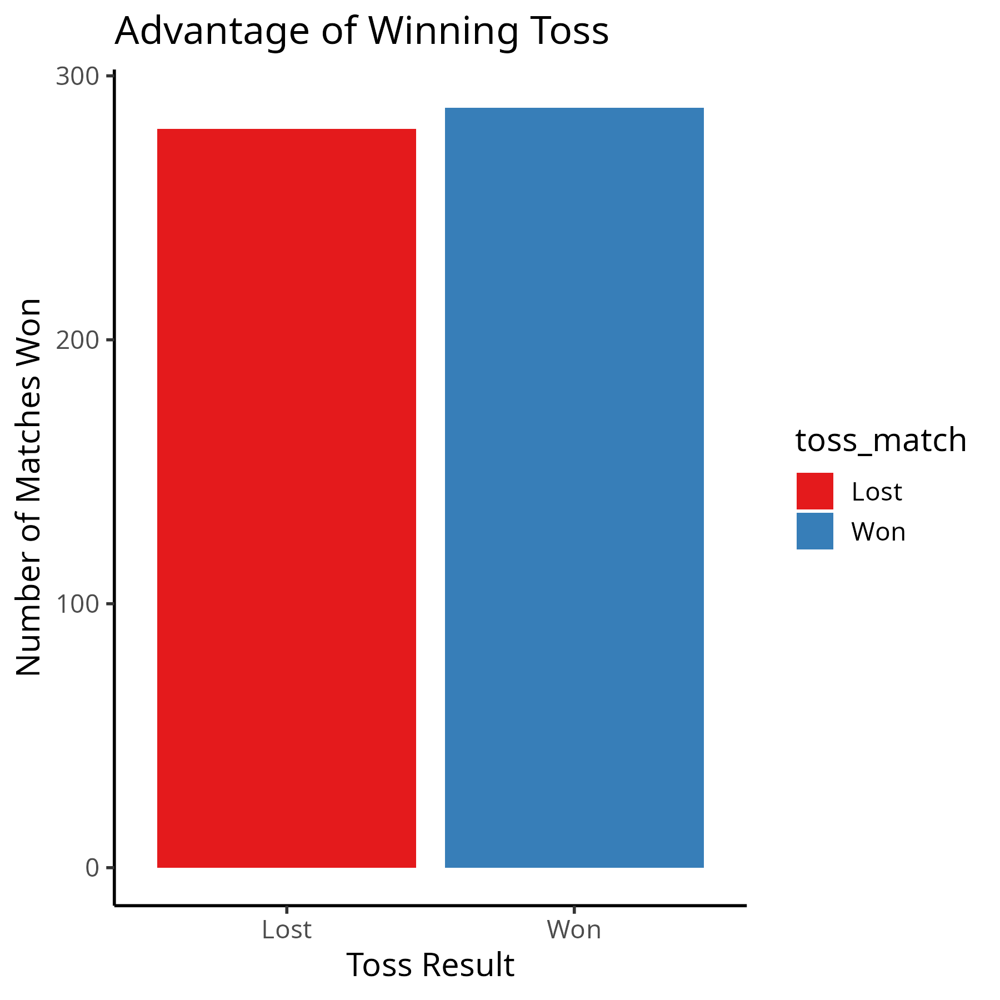
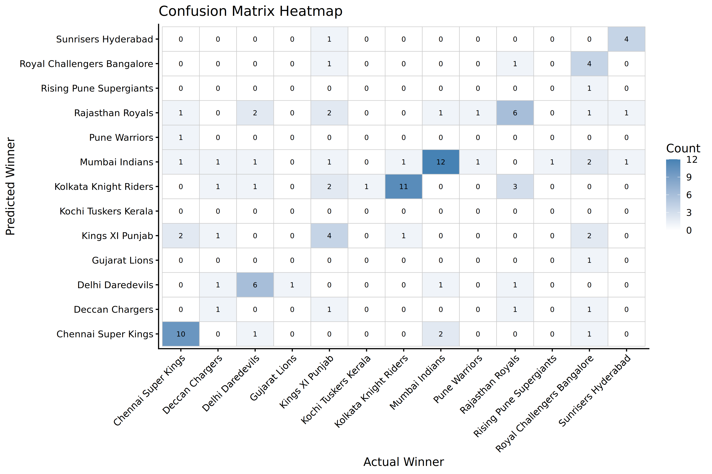

# 🏏 IPL Data Analytics & Predictive Modeling (R)

This project performs **exploratory data analysis (EDA), visualization, and predictive modeling** on Indian Premier League (IPL) datasets (`matches.csv` and `deliveries.csv`).  
It highlights **team performance, player statistics, match trends, and predictive insights** using R.

---

## 📂 Dataset
- **`matches.csv`**: Match-level details (teams, venue, toss, winner, results, etc.)
- **`deliveries.csv`**: Ball-by-ball data (batsman, bowler, runs, extras, dismissals, etc.)

Dataset source: [Kaggle IPL Dataset](https://www.kaggle.com/datasets/manasgarg/ipl)  

---

## 🔑 Features & Analysis

### 📊 Exploratory Data Analysis
- Matches played across **cities and teams**
- **Toss impact** on winning probability
- **Home advantage** analysis
- Team **win percentages**
- Top **batsmen and bowlers**
- Dismissal types and batting strike rates

### 🎨 Visualizations
- Bar plots for team wins, matches played, winning percentage
- Treemaps of runs scored against different teams
- Strike rate progression by over
- Season-wise runs comparison
- Partnership networks using `igraph`
- Clustering of batsmen vs bowlers strike rates

### 🤖 Machine Learning
- **Random Forest models** for:
  - Predicting **match winners** (based on toss, teams, city, season)
  - Predicting **runs scored by batsmen** ball-by-ball
- Evaluation with:
  - **Accuracy scores**
  - **Confusion matrix heatmap**
  - **Predicted vs Actual runs plots**

---

## 🛠️ Tech Stack
- **Language**: R  
- **Libraries**:  
  - Data Wrangling → `dplyr`, `tidyr`, `tidyverse`  
  - Visualization → `ggplot2`, `viridis`, `treemap`, `igraph`  
  - Machine Learning → `caret`, `randomForest`  
  - Others → `scales`, `RColorBrewer`, `reshape2`  

---

## 📂 Project Structure
├── IPL/
│ ├── matches.csv
│ ├── deliveries.csv
├── Plots/ # All generated plots saved here
├── project(IPL).R # Main R script
└── README.md


---

## 📸 Sample Outputs

### Matches by City


### Toss Advantage


### Confusion Matrix (Random Forest Winner Prediction)


---

## 🚀 How to Run
1. Clone the repository:
   ```bash
   git clone https://github.com/<your-username>/ipl-analysis.git
   cd ipl-analysis
2. Open R or RStudio.

3. Install required packages:
   ```bash
   install.packages(c("readr", "dplyr", "ggplot2", "tidyr", "tidyverse", 
                   "treemap", "RColorBrewer", "caret", "randomForest", "scales", "viridis", "igraph", "reshape2"))
4.  Run the script
   ```bash
source("project(IPL).R")

